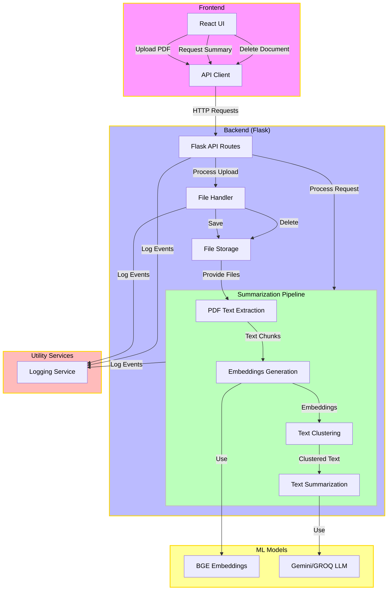

# Legal/Medical Document RAG System ⚖️


## Overview
The **Legal/Medical Document RAG System** is an **AI-driven** platform that processes legal and medical PDFs using **Retrieval-Augmented Generation (RAG)**. It leverages cutting-edge **NLP** and multiple **LLM providers** for intelligent summarization and interactive analysis. The **React-based frontend** enables smooth document management, while the **Flask backend** efficiently handles text extraction, embeddings, clustering, and summarization.

Designed for scalability 🚀, the system supports multiple PDFs with up to **20K+ pages**. It integrates **Hugging Face embeddings**, LLM-based summarization, and a modular API for seamless document processing. **Security** 🔒 is ensured through API key management and secure file handling, making it adaptable for future LLM integrations.

## Features
- **PDF Document Processing**: Upload and analyze PDF documents with **20K+ pages** and generate comprehensive summaries 📄.
- **Intelligent Summarization**: Utilizes clustering and state-of-the-art language models for in-depth document summarization.
- **Modern Web Interface**: Responsive React-based frontend with **dark mode support**.
- **Multi-Model Support**: Compatible with multiple LLM providers (**Groq**, **Google Gemini**, **LangChain**).
- **Document Management**: Full lifecycle management including upload and deletion capabilities.

## Quick Start

1. **Clone the repository:**
   ```bash
   git clone https://github.com/Yash8745/Legal_Medical_RAG.git
   cd Legal_Medical_RAG
   ```

2. **Set up the backend with conda:**
   - **Create and activate a conda environment:**
     ```bash
     conda create -n legal_medical_rag python=3.10
     conda activate legal_medical_rag
     ```
   - **Install backend dependencies:**
     ```bash
     pip install -r requirements.txt
     ```
   - **Set up environment variables:**
     ```bash
     cp .env.example .env
     ```
     Edit the newly created `.env` file to include your API keys:
     - `GEMINI_API_KEY`
     - `GROQ_API_KEY`
     - `PINECONE_API_KEY`
     
   - **Google Cloud CLI Setup:**
     Ensure you have the **Google Cloud CLI** installed and configured on your computer. Generate authentication credentials by following the official [Google Cloud SDK documentation](https://cloud.google.com/sdk/docs/install).

3. **Set up the frontend:**
   - Navigate to the **frontend** directory and install dependencies while starting the development server:
     ```bash
     cd frontend
     npm install && npm run dev
     ```

4. **Access the application:**
   Open your web browser and visit [http://localhost:5173](http://localhost:5173) to view the application.


## Project Workflow
1. **Upload:** User uploads a PDF document.
2. **Processing:** The system processes the document through a pipeline:
   - **Text Extraction**
   - **Embedding Generation**
   - **Clustering**
   - **Summarization**
3. **Output:** User receives an interactive summary with follow-up capabilities for further analysis.



## System Architecture

#### Directory Structure:
```
Directory structure:
└── yash8745-legal_medical_rag/
    ├── README.md                    # Project overview and instructions
    ├── app.py                       # Main Flask application handling API routes
    ├── requirements.txt             # Python dependencies
    ├── test.py                      # Script for testing backend functionality
    ├── documentation/               # Detailed project documentation
    │   ├── idea.md
    │   ├── api.md
    │   ├── getting-started.md
    │   ├── technical.md
    ├── frontend/                   # Frontend source code
    │   ├── index.html
    │   ├── src/
    │   │   ├── App.tsx             # Main React component
    │   │   └── api/
    │   │       └── api.ts          # Handles API calls
    ├── logs/                       # Application logs
    │   ├── app.log
    ├── model/                      # ML models and processing modules
    │   ├── cluster.py
    │   ├── embedding.py
    │   └── summarization.py
    ├── notebooks/                  # Jupyter notebooks for experiments and visualizations
    │   ├── Gemini_Summary.ipynb
    │   ├── RAG_SUMMARY_GRAPH.ipynb
    │   └── Summary_KMeans_LLM.ipynb
    ├── pipeline/                   # Document processing pipeline
    │   └── summarize_document.py
    └── utils/                      # Utility scripts and logging
        ├── data_ingestion_util.py
        └── logger.py
```

## Tech Stack 🏗️  

### 🌐 Frontend  
- **React 18** – Modern UI development  
- **TypeScript** – Type-safe JavaScript  
- **Tailwind CSS** – Utility-first styling  
- **Vite** – Fast frontend bundler  
- **Lucide Icons** – Lightweight icon library  

### 🖥️ Backend  
- **Flask** – Python web framework  
- **LangChain** – LLM orchestration  
- **Hugging Face** – Text embeddings  
- **Multiple LLM Providers** – **Groq**, **Google Gemini**

## Documentation

For a comprehensive understanding of the project, refer to our detailed documentation:

- **[Getting Started Guide](documentation/getting-started.md):** Provides step-by-step instructions for setting up the project, from installation to running the initial version. It’s the perfect starting point for new users.
- **[Technical Documentation](documentation/technical.md):** Dive into the system’s architecture and design decisions. This section covers the project structure, core modules, and the technologies powering the system.
- **[API Documentation](documentation/api.md):** Explore the available API endpoints, learn about request/response formats, and review integration examples. Essential reading for developers looking to extend or integrate with the system.


## License

This project is licensed under the BSD 3-Clause License. Redistribution and use in source and binary forms, with or without modification, are permitted provided that the following conditions are met:

- Redistributions of source code must retain the above copyright notice, this list of conditions,
and the following disclaimer.

- Redistributions in binary form must reproduce the above copyright notice, this list of conditions,
and the following disclaimer in the documentation and/or other materials provided with the distribution.

- Neither the name of the project nor the names of its contributors may be used to endorse or promote products
derived from this software without specific prior written permission.

Please credit **Yash Narang** for any use or redistribution of this project.

## Contact
For any questions, please reach out to Yash Narang at **narangyash32@gmail.com**.

