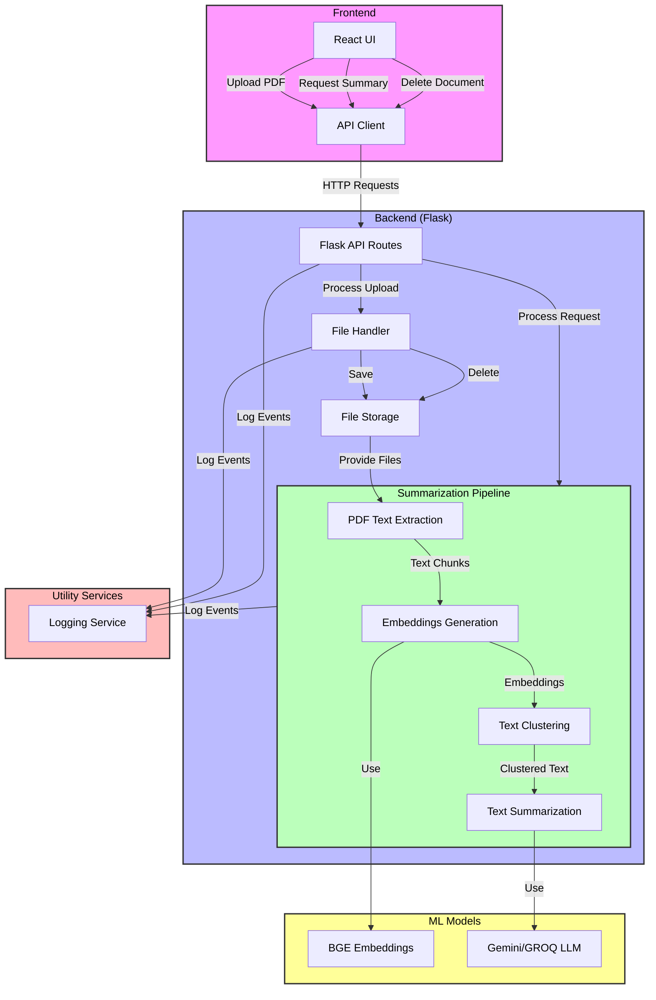

# Legal/Medical Document RAG System

A sophisticated document analysis system designed to process and summarize legal and medical documents using advanced NLP techniques and RAG (Retrieval Augmented Generation) architecture.

## Features

- **PDF Document Processing**: Upload and analyze PDF documents with automatic text extraction
- **Intelligent Summarization**: Utilizes clustering and state-of-the-art language models for comprehensive document summarization
- **Modern Web Interface**: Responsive React-based frontend with dark mode support
- **Multi-Model Support**: Compatible with multiple LLM providers (Groq, Google Gemini)
- **Document Management**: Full document lifecycle management with upload and deletion capabilities

## Tech Stack

### Backend
- Flask (Python web framework)
- LangChain (LLM orchestration)
- Hugging Face (Embeddings)
- Multiple LLM providers (Groq, Google Gemini)

### Frontend
- React 18
- TypeScript
- Tailwind CSS
- Vite
- Lucide Icons

## Project Structure

```
yash8745-legal_medical_rag/
├── Backend (Flask)
│   ├── app.py                 # Main Flask application
│   ├── model/                 # ML model implementations
│   ├── pipeline/              # Document processing pipeline
│   └── utils/                 # Utility functions
├── Frontend (React)
│   └── frontend/             # React application
└── Documentation
    └── documentation/        # Detailed documentation
```

## Prerequisites

- Python 3.8+
- Node.js 16+
- API keys for:
  - Groq
  - Google Gemini
  - Pinecone (for vector storage)

## Quick Start

1. Clone the repository:
```bash
git clone https://github.com/yourusername/yash8745-legal_medical_rag.git
cd yash8745-legal_medical_rag
```

2. Set up backend:
```bash
# Create and activate virtual environment
python -m venv venv
source venv/bin/activate  # On Windows: venv\Scripts\activate

# Install dependencies
pip install -r requirements.txt

# Set up environment variables
cp .env.example .env
# Edit .env with your API keys
```

3. Set up frontend:
```bash
cd frontend
npm install
```

4. Start the services:
```bash
# Start backend (in project root)
python app.py

# Start frontend (in frontend directory)
npm run dev
```

5. Access the application at `http://localhost:5173`

## Documentation

- [Getting Started Guide](documentation/getting-started.md)
- [Technical Documentation](documentation/technical.md)
- [API Documentation](documentation/api.md)

## Contributing

Please read [CONTRIBUTING.md](CONTRIBUTING.md) for details on our code of conduct and the process for submitting pull requests.

## License

This project is licensed under the MIT License - see the [LICENSE](LICENSE) file for details.


---
# Legal/Medical Document RAG System

## Overview
The Legal/Medical Document RAG System is an intelligent document analysis platform that processes legal and medical PDFs using Retrieval-Augmented Generation (RAG). It provides intelligent summarization and analysis by leveraging modern NLP techniques, multiple LLM providers, and a React-based frontend.

## System Architecture

### Frontend (React + TypeScript)
#### Features:
- Document upload and management
- Dark/light mode toggle
- Real-time chat interface
- Document summary generation
- Responsive UI with Tailwind CSS

#### Structure:
```
frontend/
  src/
    App.tsx           // Main application component
    api/api.ts        // API integration
    main.tsx          // Application entry point
```

#### Component Details:
- File upload handling
- Document management (upload/delete)
- Chat interface
- Dark mode toggle
- Summary generation

### Backend (Flask)
#### Core Components:
```
backend/
  app.py                  # Main Flask application
  model/
    ├── cluster.py       # Text clustering
    ├── embedding.py     # Document embeddings
    └── summarization.py # Text summarization
  pipeline/
    └── summarize_document.py  # Main processing pipeline
  utils/
    ├── data_ingestion_util.py # PDF processing
    └── logger.py             # Logging utilities
```

#### Processing Pipeline:
1. **PDF Ingestion**
```python
def extract_text_from_pdf(file_path, chunk_size=2000, chunk_overlap=0):
    loader = DirectoryLoader(file_path, glob="*.pdf", loader_cls=PyPDFLoader)
    pages = loader.load()
    text_splitter = RecursiveCharacterTextSplitter(
        chunk_size=chunk_size, chunk_overlap=chunk_overlap
    )
    return text_splitter.split_documents(pages)
```
2. **Embedding Generation**
```python
def get_embeddings_model(model_name="BAAI/bge-base-en-v1.5", device="cuda"):
    encode_kwargs = {"normalize_embeddings": True}
    return HuggingFaceBgeEmbeddings(
        model_name=model_name,
        encode_kwargs=encode_kwargs
    )
```
3. **Text Clustering**
```python
def cluster_texts(texts, embeddings, num_clusters=5):
    filter = EmbeddingsClusteringFilter(
        embeddings=embeddings,
        num_clusters=num_clusters
    )
    return filter.transform_documents(documents=texts)
```
4. **Summarization**
```python
def summarize_texts(texts, llm, chain_type="stuff"):
    checker_chain = load_summarize_chain(llm, chain_type=chain_type)
    return checker_chain.run(texts)
```

### API Endpoints
```python
@app.route('/upload', methods=['POST'])
# Handles PDF file uploads and returns file ID and status

@app.route('/documents/<doc_id>', methods=['DELETE'])
# Deletes specified document and manages file storage

@app.route('/chat', methods=['POST'])
# Processes document summarization requests and returns AI-generated summaries
```

## Dependencies

### Backend:
```plaintext
Flask               # Web framework
flask_cors          # CORS support
langchain           # LLM orchestration
transformers        # ML models
pinecone            # Vector storage
unstructured        # PDF processing
google-genai        # Gemini AI integration
```

### Frontend:
```json
{
  "react": "^18.3.1",
  "typescript": "^5.5.3",
  "tailwindcss": "^3.4.1",
  "axios": "^1.7.9",
  "lucide-react": "^0.344.0"
}
```

## Key Implementation Details

1. **Document Processing**
   - Uses PyPDFLoader for text extraction
   - Implements chunk-based processing for large documents
   - Maintains document state using unique IDs

2. **AI Integration**
   - Supports multiple LLM providers (Groq, Google Gemini)
   - Uses HuggingFace embeddings for semantic analysis
   - Implements clustering for improved summarization

3. **Frontend Features**
   - Real-time file upload with progress
   - Document management interface
   - Chat-based interaction with AI
   - Responsive design with dark mode

4. **Security**
   - API key management via environment variables
   - Input validation and sanitization
   - Secure file handling

## Environment Configuration
```plaintext
GROQ_API_KEY=''        # Groq API access
PINECONE_API_KEY=''    # Pinecone vector DB
GEMINI_API_KEY=''      # Google Gemini AI
```

## Running the System

### Backend Setup:
```bash
python -m venv venv
source venv/bin/activate
pip install -r requirements.txt
python app.py
```

### Frontend Setup:
```bash
cd frontend
npm install
npm run dev
```

## Project Workflow
1. User uploads a PDF document.
2. The system processes the document through a pipeline:
   - Text extraction
   - Embedding generation
   - Clustering
   - Summarization
3. User receives an interactive summary.
4. Supports follow-up questions and analysis.

## Extension Points
1. **Additional LLM Providers**
   - Architecture supports new LLM integration.
   - Modular design for model switching.

2. **Enhanced Processing**
   - Support for additional document types.
   - Custom preprocessing pipelines.
   - Advanced clustering algorithms.

3. **Frontend Features**
   - Additional visualization options.
   - Enhanced document management.
   - Custom summarization options.

## Notes for AI Implementation
- The system employs a RAG architecture for improved accuracy.
- Document processing is modular and extensible.
- Frontend and backend are loosely coupled.
- Environment variables are required for API access.
- The system supports both CPU and GPU operations.
- Logging is implemented throughout the pipeline.
- Error handling ensures graceful degradation.
- Designed for legal/medical document processing but adaptable for other domains.

## License
This project is licensed under the MIT License.

## Contributors
- **[Your Name]** - Developer & Architect

## Contact
For inquiries or collaborations, please reach out to **[Your Email]**.

