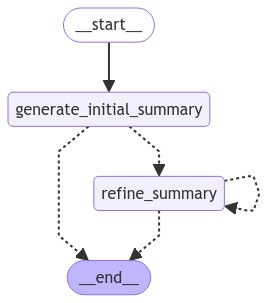

# **Idea**

## **Initial Concept**

The first idea was to create a **RAG-based system** capable of selectively processing only the **important documents** before summarizing them. However, when reviewing the data—especially in the context of **medical and legal documents**—I discovered that **every detail** was significant, down to the minutest elements. Due to the **large volume** and **critical nature** of the details, this approach was not feasible.

> **Diagram: Data Sources and LLM App**  
> 

## **Exploring Summarization Techniques**

The next phase involved researching various methods for summarizing **large volumes** of documents. I encountered several approaches, including:

- **STUFF Method:** Concatenating documents until the model's token limit is reached.  
- **Map-Reduce Summarization:** Summarizing individual documents (map) and then combining those summaries into a comprehensive summary (reduce).  
- **Iterative Refining:** Generating an initial summary and then refining it iteratively to improve accuracy.  
- **Agentic Summarization:** Utilizing AI agents to autonomously generate and refine summaries.

Each of these techniques offers distinct advantages depending on the context and the amount of data involved.

> **Diagram: STUFF vs. Map-Reduce**  
> 

## **Clustering and Hierarchical Summarization**

Eventually, I devised a method that leverages **clustering** and **hierarchical summarization**:

1. **Clustering Documents:**  
   Similar documents are grouped using **K-Nearest Neighbors (KNN)** based on word embeddings.
   
2. **Summarizing Clusters:**  
   Each cluster is summarized individually to extract key information.
   
3. **Refining Summaries:**  
   The cluster summaries are further refined through an **iterative** process to produce a final, cohesive summary.

> **Diagram: Document Loader, Clustering, and Summarization Flow**  
> 

### **Iterative Refining**

Below is a small flow diagram illustrating how the summary can be **refined repeatedly** until the final version is produced:

> **Diagram: Iterative Refining Process**  
> 

## **Model Selection and Integration**

Initially, I experimented with the **LLaMA 8B model** from Groq. However, due to its limited context window, I later transitioned to the **Gemini** model. The Gemini model offers:

- **Larger Context Window:** Allows the model to consider more content at once, crucial for lengthy documents.
- **Flash Attention Mechanism:** Enhances efficiency by optimizing attention calculations over long sequences.

### **Theory on Model Capabilities**

The Gemini model’s **enhanced context window** is particularly beneficial for summarizing documents where **every detail** is critical. Its **flash attention** mechanism reduces processing time and resource usage, making it well-suited for real-time summarization tasks in complex domains.

## **Experimentation and Validation**

To explore and validate these methods, you can run the **Jupyter Notebook**:

- **Notebook:** `summary_kmeans_llm.ipynb`  
  This notebook demonstrates the **clustering** and **summarization** process, allowing you to see the practical application of the method.

## **Future Scope: Implementing RAG with Enhanced Document Summarization**

Looking ahead, there is potential to further enhance this system by integrating **Retrieval-Augmented Generation (RAG)**:

- **Cluster-Based Embeddings:**  
  Instead of storing the entire document directly, store the **summaries of clusters**, convert them into **embeddings**, and save them in a vector database.

- **Query-Based Summarization:**  
  Use the **vector database** to query for relevant clusters, enabling the generation of **tailored timelines** or summaries based on specific user queries.

- **AI Agents for Iterative Refinement:**  
  Explore the use of **AI agents** to facilitate more effective iterative summarization. While promising, this approach will require further research to optimize.

This future vision aims to create a **robust system** where **summaries** are not only generated but also stored and retrieved in a way that **enhances user interaction** and overall **efficiency**.
