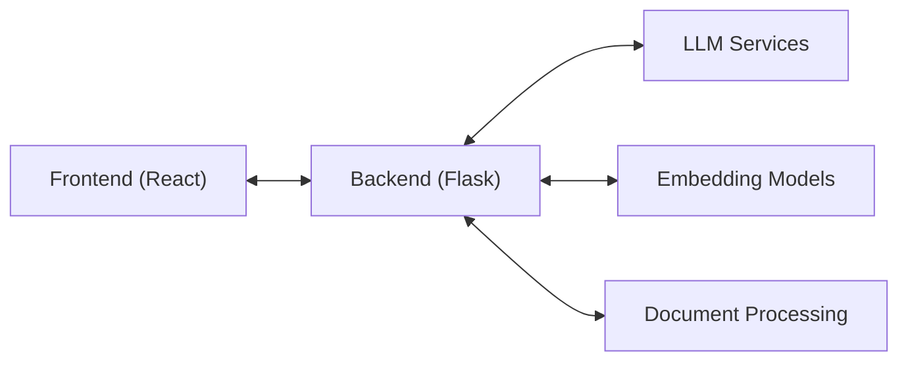
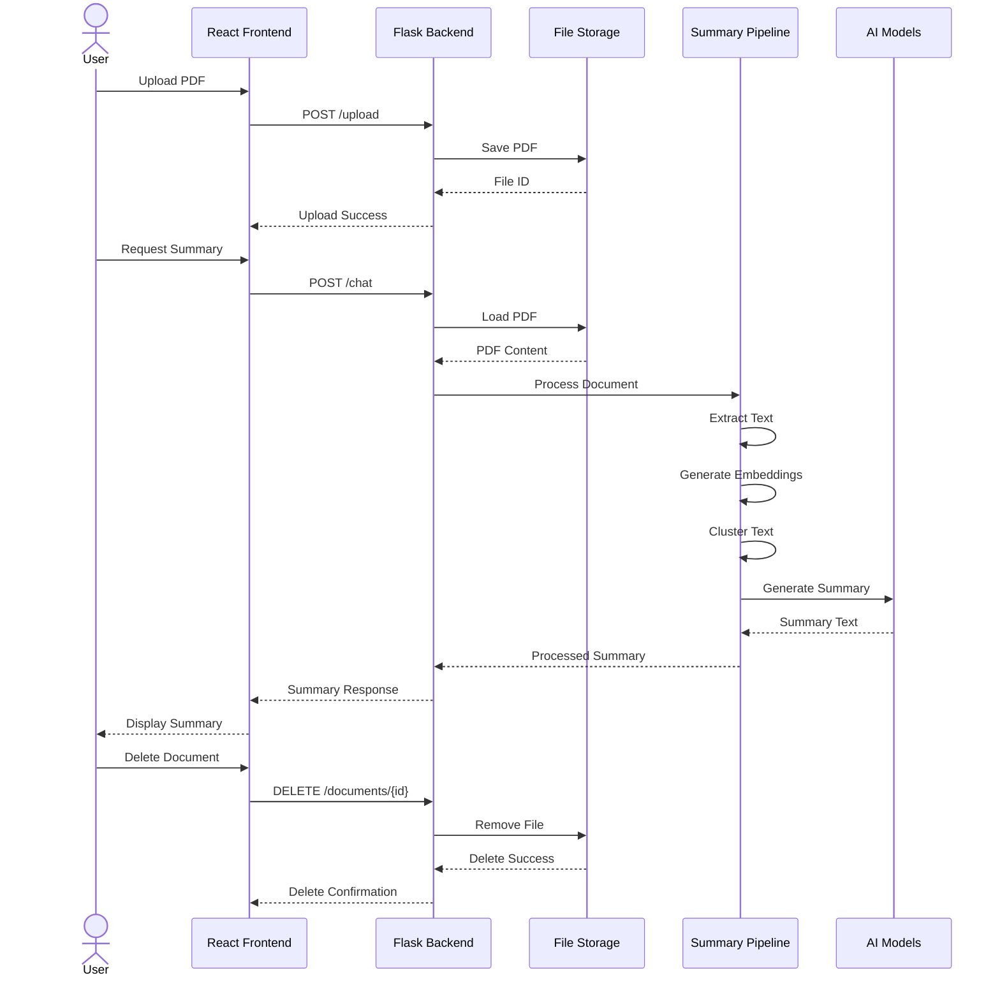
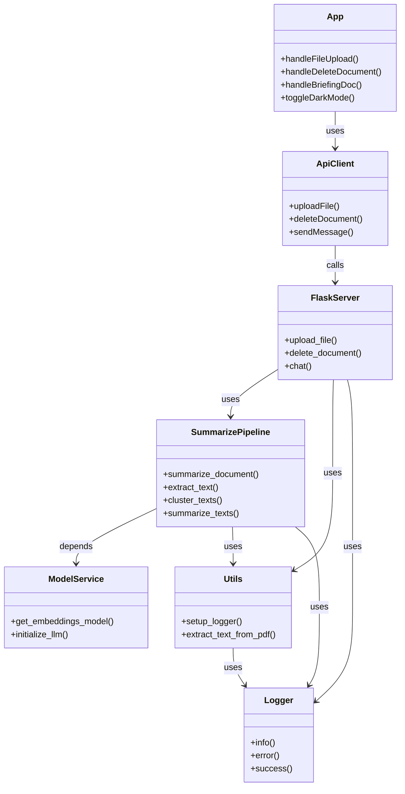

# **<span style="font-size:1.2em;">Technical Documentation</span>**

This document provides an in-depth look at the **<span style="color:#1E90FF;">Legal/Medical Document RAG System</span>**, covering its architecture, core components, and implementation details. It also includes suggestions and best practices for improving performance, scalability, and security.


## **<span style="font-size:1.1em;">Architecture Overview</span>**

The system implements a **<span style="color:#1E90FF;">document processing pipeline</span>** using modern NLP techniques, including:

- **K-Means Clustering:**  
  Groups similar document segments using K-Means, which helps in identifying and isolating core themes across large datasets.

- **Mapping:**  
  Associates each cluster with key topics or themes, ensuring that the most relevant information is captured for summarization.

- **Iterative Refining:**  
  Applies an iterative process to continuously refine the summaries, enhancing clarity and ensuring that all crucial details are retained.


### **High-Level Architecture**



- **Frontend (React):** Handles user interactions, file uploads, and displays summaries.
- **Backend (Flask):** Receives and processes requests, orchestrates document processing, and communicates with external services.
- **LLM Services:** Multiple Large Language Models (LLMs) for text summarization and analysis.
- **Embedding Models:** Used for generating semantic embeddings, crucial for clustering and search.
- **Document Processing:** Manages text extraction, chunking, clustering, and other transformations.


## **<span style="font-size:1.1em;">Core Components</span>**

### 1. **Document Processing Pipeline**

The system processes documents through several stages:

1. **<span style="color:#1E90FF;">Text Extraction</span>** (`utils/data_ingestion_util.py`)  
   - Uses **PyPDFLoader** for PDF parsing.  
   - Implements **RecursiveCharacterTextSplitter** for chunk management.  
   - Handles large documents via streaming to manage memory effectively.

2. **<span style="color:#1E90FF;">Embedding Generation</span>** (`model/embedding.py`)  
   - Uses **HuggingFaceBgeEmbeddings**.  
   - Model: **"BAAI/bge-base-en-v1.5"**.  
   - Optimized for **semantic understanding** of text.

3. **<span style="color:#1E90FF;">Text Clustering</span>** (`model/cluster.py`)  
   - Implements **EmbeddingsClusteringFilter**.  
   - Groups similar content for **improved summarization**.  
   - Allows a configurable number of clusters.

4. **<span style="color:#1E90FF;">Summarization</span>** (`model/summarization.py`)  
   - Supports multiple **LLM providers**.  
   - Implements **different summarization strategies** (e.g., STUFF, Map-Reduce, etc.).  
   - Handles **context management** to fit within model token limits.

### 2. **Language Models**

The system supports multiple **<span style="color:#1E90FF;">LLM providers</span>**:

1. **Groq Integration**  
   - Model: **llama3-8b-8192**  
   - Optimized for **speed** and **accuracy**  
   - Suitable for **detailed analysis**

2. **Google Gemini Integration**  
   - Model: **gemini-2.0-flash**  
   - Excellent for **general summarization**  
   - Provides strong **multilingual** capabilities

### 3. **Frontend Architecture**

Built with **React** and **TypeScript**, following modern best practices:

1. **State Management**  
   - React Hooks for local state  
   - Custom hooks for business logic  
   - Efficient document and summary management

2. **UI Components**  
   - **Tailwind CSS** for styling  
   - **Lucide Icons** for a consistent look  
   - **Dark mode** support for better user experience

3. **API Integration**  
   - **Axios** for HTTP requests  
   - Error handling middleware  
   - **File upload** management with progress tracking


### **System Flow (Sequence Diagram)**




## **<span style="font-size:1.1em;">Key Technologies</span>**

### **Backend Technologies**

- **<span style="color:#1E90FF;">Flask</span>**  
  Lightweight web framework with **CORS** support and file handling capabilities.
- **<span style="color:#1E90FF;">LangChain</span>**  
  LLM orchestration, document processing, and chain management.
- **<span style="color:#1E90FF;">Hugging Face</span>**  
  Embedding models, tokenization, and model management.

### **Frontend Technologies**

- **<span style="color:#1E90FF;">React 18</span>**  
  Functional components, Hooks architecture, Strict Mode enabled.
- **<span style="color:#1E90FF;">TypeScript</span>**  
  Type safety, enhanced IDE support, and better code organization.
- **<span style="color:#1E90FF;">Tailwind CSS</span>**  
  Utility-first styling, responsive design, and built-in dark mode.


## **<span style="font-size:1.1em;">Implementation Details</span>**

### **Document Processing Flow**

1. **Upload Phase**  
   ```python
   @app.route('/upload', methods=['POST'])
   def upload_file():
       file = request.files['file']
       file_id = str(uuid.uuid4())
       file_mappings[file_id] = file.filename
   ```
   - Receives file from user.  
   - Generates a unique **file_id** for tracking.

2. **Processing Phase**  
   ```python
   def summarize_document(file_path):
       embeddings = get_embeddings_model()
       texts = extract_text_from_pdf(file_path)
       clustered_texts = cluster_texts(texts, embeddings)
       return summarize_texts(clustered_texts, llm)
   ```
   - Extracts text and generates embeddings.  
   - Clusters text for improved **cohesion** in summaries.  
   - Summarizes the clusters with an **LLM**.

3. **Response Phase**  
   ```python
   @app.route('/chat', methods=['POST'])
   def chat():
       message = data.get('message', '')
       response = summarize_document(FILE_PATH)
       return jsonify({'response': response})
   ```
   - Returns the **summarized text** as JSON.  
   - Integrates seamlessly with **frontend** for display.


### **Class Diagram**

